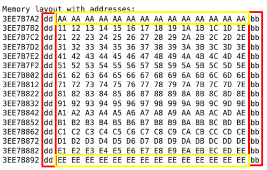

# Memory Allocation with Magic Numbers

This program demonstrates how to allocate a memory region with specific values for the walls (top, side, bottom) and a magic number at specified positions. The program simulates the `xxd -p` output with memory addresses, providing a hex dump similar to the `xxd` utility.

## Configuration

- **Top Wall**: The first 16 bytes are filled with `TOP_WALL_BYTE`.
- **Bottom Wall**: The last 16 bytes are filled with `BOTTOM_WALL_BYTE`.
- **Side Walls**: Every 4th byte is set to `SIDE_WALL_BYTE`.
- **Magic Number**: Inserted at the specified positions.

## Functions

- `print_memory_with_addresses`: Simulates the `xxd -p` output with memory addresses.
- `print_xxd_simulation`: Simulates the `xxd -p` output without addresses.

## Memory Layout

- Top Wall: The first 16 bytes are filled with `TOP_WALL_BYTE`.
- Bottom Wall: The last 16 bytes are filled with `BOTTOM_WALL_BYTE`.
- Side Walls: Every 4th byte is set to `SIDE_WALL_BYTE`.
- Magic Number: Inserted at specified positions.

## Example Output

Memory layout with addresses: 00000000 01 01 01 01 01 01 01 01 01 01 01 01 01 01 01 01 00000010 02 00 00 00 00 xx xx xx xx xx xx 00 00 00 00 02 00000020 03 03 03 03 03 03 03 03 03 00 00 00 03 03 03 03

xxd -p simulation: 010101010101010101010101010101010200000000xxxxxxxx000000000203030303030303030303000000003030303

xxd -p output from random starting address: ...

