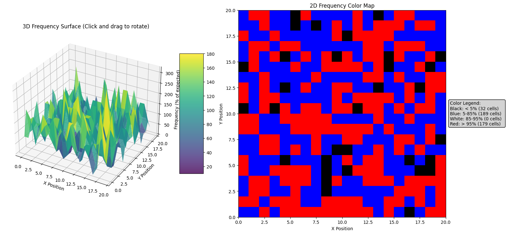
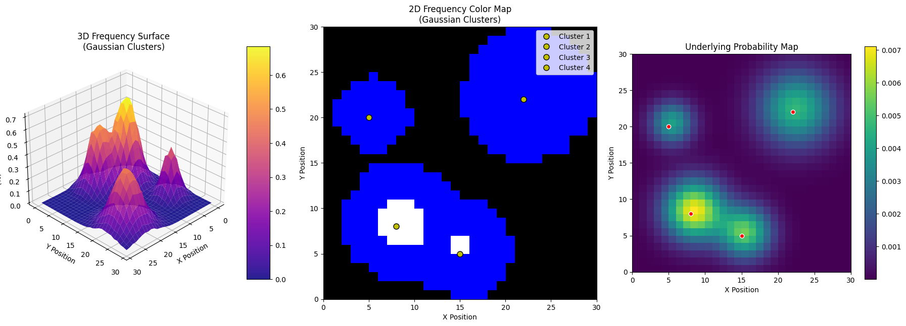

# Memory Heat Map

Make a NxN grid and randomly choose the array to simulate filling with data. plot a 3D grid and make it rotatable to see the peaks. 

Color distribution (frequency):
- Black (< 5%): 32 cells
- Blue (5-85%): 189 cells
- White (85-95%): 0 cells
- Red (> 95%): 179 cells

2D Color Map: Now exhibits clear colored regions instead of being all black:
- Red/White near the peak regions (high frequency),
- Blue for moderate areas,
- Black where almost no selections occurred.

